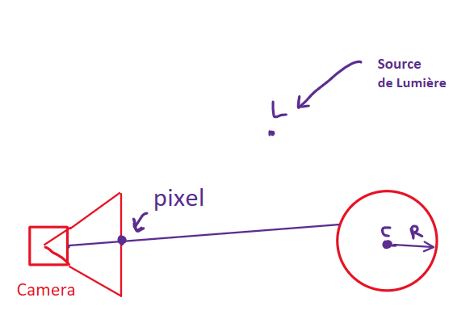
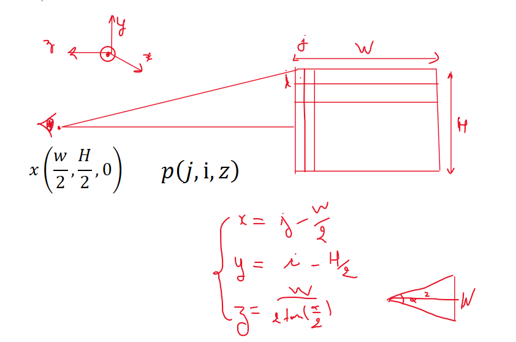
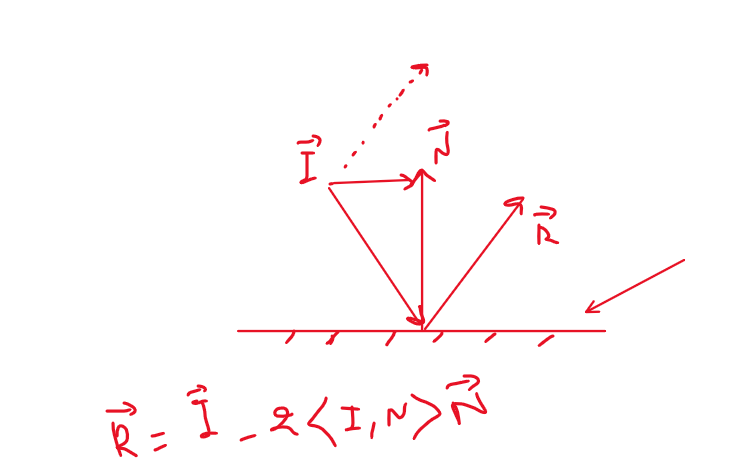
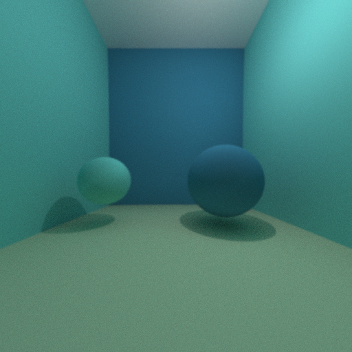
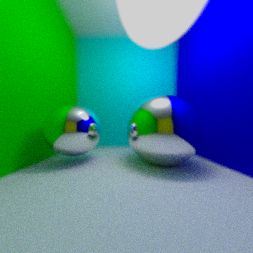

# Ray-tracing-with-C++

## Notre première sphere

- Une source de lumière blanche est représentée par une source omnidirectionnelle positionnée en un point L.
- Une caméra est placée en un point C, composée d'une grille de pixels positionnée à une distance Z de C et de taille (W, H), soit un total de W*H pixels.

Dans un premier temps, une sphère est positionnée devant la caméra, avec son centre à O et un rayon de R.

L'approche est la suivante : des demi-droites sont tracées à partir du centre de la caméra C et dirigées par un vecteur u. Chaque demi-droite traverse la grille en un pixel, résultant ainsi en W*H demi-droites passant par C et dirigées par le vecteur unitaire :

u = ( j-W/2, i-H/2, -W/(2.tan(α/2)))

demo: voir figure 1

où (i, j) sont les coordonnées du pixel sur l'écran de la caméra.





Pour chaque demi-droite, l'intersection avec la sphère est calculée. On résout l'équation suivante :

t<sup>2</sup> + 2.t.<u,CO> + ||CO||<sup>2</sup> - R<sup>2</sup> = 0

demo: 

Pour démontrer l'équation $\(t^2 + 2t \langle u, CO \rangle + \|CO\|^2 - R^2 = 0\)$, nous allons utiliser l'équation d'une sphère et l'équation d'une demi-droite dans l'espace.

1. **Équation de la demi-droite** : Une demi-droite partant de C et dirigée par le vecteur unitaire u peut être représentée par $\(P = C + tu\)$, où $\(P\)$ est un point quelconque sur la demi-droite, $\(C\)$ est le point de départ (le centre de la caméra), $\(u\)$ est le vecteur direction de la demi-droite, et $\(t\)$ est un paramètre scalaire.

2. **Équation de la sphère** : L'équation d'une sphère de centre $\(O\)$ et de rayon $\(R\)$ est $\(\|X - O\|^2 = R^2\)$, où $\(X\)$ est un point quelconque sur la sphère.

Pour trouver les points d'intersection, nous substituons \(P\) de l'équation de la demi-droite dans l'équation de la sphère.

3. **Substitution** : Remplaçons $\(X\)$ par $\(P = C + tu\)$ dans l'équation de la sphère :

$\[
\|C + tu - O\|^2 = R^2
\]$

Développons cette équation :

$\[
\|tu + (C - O)\|^2 = R^2
\]$

$\[
\|(tu + CO)\|^2 = R^2
\]$

où $\(CO = C - O\)$.

En développant le carré du vecteur, nous obtenons :

$\[
(tu + CO) \cdot (tu + CO) = R^2
\]$

$\[
t^2(u \cdot u) + 2t(u \cdot CO) + CO \cdot CO = R^2
\]$

Puisque $\(u\)$ est un vecteur unitaire, $\(u \cdot u = 1\)$, l'équation devient :

$\[
t^2 + 2t(u \cdot CO) + \|CO\|^2 = R^2
\]$


### Classes Implémentées :

Les classes mises en œuvre sont les suivantes :

1. Une classe Vector : elle contient les coordonnées du vecteur et diverses méthodes pour surcharger les opérations d'addition, soustraction, produit scalaire, produit par une constante, ainsi que le calcul de la norme.

2. Une classe Sphere : elle contient le centre et le rayon de la sphère.

3. Une classe Ray : elle contient un point du rayon et son vecteur directeur.


### Notre première sphére éclairée

Dans cette version, la couleur attribuée à un pixel de la caméra est modifiée pour obtenir du contraste et discerner les volumes des objets.

Plutôt que d'attribuer une couleur blanche à un pixel où un rayon aurait collisionné avec un objet, on attribue une couleur dont l'intensité est variable.

L'intensité lumineuse en un point P d'un objet est calculée selon la formule :

$\[ I_p = \frac{I}{4\pi\|\text{LP}\|^2} \cdot \langle\mathbf{N},\frac{\mathbf{PL}}{\|\mathbf{PL}\|}\rangle \cdot \frac{\rho}{\pi} \]$

où :

- $\(I\)$ est l'intensité de la source lumineuse au point L.
- $\(\mathbf{N}\)$ est la normale à l'objet (la sphère) au point P (vecteur unitaire).
- $\(\rho\)$ est l'albédo de la sphère, c'est-à-dire la fraction de la lumière que la sphère réfléchit.

Ainsi, la Figure représentée ci-dessous est obtenue. La sphère, représentée avec un albedo rouge, est bien rendue en rouge, et le reste demeure en noir.

<div align = "center">

</div>


## Notre première scene

Nous souhaitons désormais rendre la scène observée plus complexe. Jusqu'à présent, seule une sphère était positionnée devant la caméra.

Nous introduisons une classe "Scene" qui contient un vecteur d'objets. Ce vecteur contiendra les objets (par exemple, des sphères) disposés devant la caméra.

Afin de représenter correctement les objets les uns par rapport aux autres, il est nécessaire de pouvoir déterminer leur profondeur dans l'espace. Pour ce faire, une méthode est mise en œuvre pour vérifier, pour un rayon donné, les objets de la scène qui interceptent ce rayon, et ne conserver que l'objet le plus proche de la caméra (c'est-à-dire l'objet qui va masquer les objets situés derrière lui).

Nous effectuons un essai en créant une scène composée de :

Trois sphères de couleurs bleue, blanche et rouge (de gauche à droite).
Deux murs, respectivement de couleur bleue et rouge, situés à gauche et à droite.
Deux murs en face de la caméra et derrière la caméra (invisible donc), respectivement de couleur verte et magenta.
Un mur au sol de couleur blanche.

<div align = "center">

</div>

Le bruit provient des incertitudes de calcul dues à la précision numérique de la machine. Ainsi, le point d'intersection peut se retrouver à l'intérieur de la surface au lieu d'être sur la surface. Pour remédier à cela, on déplace le point d'intersection d'une petite quantité $\(\epsilon\)$ vers l'extérieur de l'objet.

``` C++
Ray rayon_sec(P + 0.001*N, (position_lumiere-P).getNormalized());
```

### Amélioration du Contraste des Objets :

Nous cherchons ici à améliorer le contraste des objets. En effet, dans la dernière scène obtenue, nous avons remarqué la faible luminosité des murs en arrière-plan.

La **correction Gamma** est utilisée pour améliorer le contraste en effectuant une opération simple sur l'intensité lumineuse calculée pour chaque pixel :

$\[ I = I_{\text{calculée}}^{1/\gamma} \]$

avec $\(\gamma = 2,2\) et \(1/\gamma = 0,45\)$.

Cette opération permet de ajuster l'intensité lumineuse, améliorant ainsi le contraste des objets dans la scène. Le paramètre \(\gamma\) joue un rôle crucial dans cette correction, et les valeurs spécifiées (2,2 et 0,45) sont couramment utilisées pour obtenir des résultats visuellement satisfaisants.


### Amélioration avec les Ombres Portées :

Nous cherchons à améliorer davantage le rendu en ajoutant les **ombres portées**, c'est-à-dire les ombres des objets projetées sur les surfaces.

La stratégie adoptée est la suivante : des rayons sont émis dans toutes les directions (vers chaque pixel de l'écran). Pour chaque rayon, on détermine son intersection avec un objet de la scène, puis on vérifie si le rayon entre cette intersection et la source de lumière coupe un autre objet. Si tel est le cas, le pixel d'intersection est rendu plus sombre.

<div align = "center">

</div>


## Surfaces Miroir :

Jusqu'à présent, les surfaces représentées étaient des surfaces opaques avec un albédo. Nous proposons maintenant de représenter un autre type de surface : les surfaces miroir.

Sur une telle surface, un rayon lumineux se reflète avec un angle de réflexion par rapport à la normale de la surface égal à l'angle d'incidence. Les réflexions peuvent être multiples dans le cas de plusieurs surfaces miroir.

Pour mettre en œuvre ces types de surfaces, on crée une fonction récursive appelée "getColor", qui permet de déterminer la couleur à l'intersection d'un rayon avec une surface opaque, ou le cas échéant, entre le rayon réfléchi et une surface miroir.

Avec cette propriété, notre raytracer évolue pour devenir un pathtracer.

Le rayon incident \(i\) est réfléchi par la surface miroir en un rayon $\(r\)$ tel que :

$\[ r = i - 2\langle i, \mathbf{N} \rangle \mathbf{N} \]$



Cette formulation reflète le rayon par rapport à la normale de la surface. Cette fonction de réflexion permet de simuler le comportement des surfaces miroir dans la scène, ajoutant ainsi des éléments de réalisme et de complexité visuelle au rendu final du raytracer.
L'implémentation de cette partie est donnée dans le fichier `sphere_scenes_shadow_mirror.cpp`, pour l'exécuter il suffit d'exécuter cette commande dans un terminale: 


```C++
 if (s.spheres[sphere_id].miroir){
                    // calcul recursive du rayon réfléchie jusqu'a que le nbr de rebond soit 0
                    Vector direction_mir = r.direction - 2*dot(N,r.direction)*N;
                    Rayon rayon_miroir (P+0.001*N, direction_mir);
                    intensite_pix = getColor(rayon_miroir, s, nbrebonds - 1);
                    } 
```

```
g++ -o main sphere_scenes_shadow_mirror.cpp
```

<div align = "center">

</div>


### Surfaces Transparentes :

<div align = "center">

</div>

Nous explorons ici la représentation d'un autre type de surface : les surfaces transparentes.

Nous faisons l'hypothèse qu'une surface transparente réfléchit l'intégralité d'un rayon ou transmet l'intégralité du rayon, sans tenir compte de la transmission de Fresnel.

Nous utilisons la loi de Snell-Descartes. Pour une surface de normale $\( \mathbf{N} \)$ séparant deux milieux d'indices respectifs $\( n_1 \)$ et $\( n_2 \)$, un rayon incident dans le milieu d'indice $\( n_1 \)$ avec un angle $\( \theta_i \)$ est transmis dans le milieu d'indice $\( n_2 \)$ avec un angle $\( \theta_t \)$ tel que :

$\[ n_1 \sin(\theta_i) = n_2 \sin(\theta_t) \]$

Grâce à cette loi, on peut exprimer les composantes tangentielle et normale du vecteur unitaire directeur du rayon transmis $\( \mathbf{T} \)$ :

$\[ \mathbf{T}_N = - \sqrt{1 - \left(\frac{n_1}{n_2}\right)^2(1-\langle \mathbf{i}, \mathbf{N} \rangle^2)} \mathbf{N} \]$

$\[ \mathbf{T}_T = \frac{n_1}{n_2} (\mathbf{i} - \langle \mathbf{i}, \mathbf{N} \rangle \mathbf{N}) \]$

En connaissant la direction du rayon transmis par la surface transparente, il devient possible de déterminer la couleur du pixel à afficher en recherchant l'intersection de ce rayon avec le reste de la scène.

Cette approche permet de simuler le comportement des surfaces transparentes, ajoutant ainsi une dimension de réalisme et de sophistication visuelle au rendu final du raytracer.


<div align = "center">

</div>

### Transmission de Fresnel

Lorsqu'un rayon traverse une surface transparente, une fraction du rayon est effectivement renvoyée par la surface, conformément aux lois de Fresnel.

Dans l'approche simplifiée de Schlick, le rayon incident se décompose en un rayon réfléchi $\( R \)$ et un rayon transmis $\( T \)$ selon les équations suivantes :

$\[ R = k_0 + (1 - k_0)(1 - | \langle \mathbf{N}, \mathbf{i} \rangle |)^5 \]$

$\[ T = 1 - R \]$

où $\( k_0 = \frac{(n_1 - n_2)^2}{(n_1 + n_2)^2} \)$.

<div align = "center">

</div>

### Eclairage indirecte

Avec le pathtracer actuel, les surfaces éclairées de manière rasante présentent une faible intensité lumineuse. Cependant, dans la réalité, ces surfaces réfléchissent une partie de la lumière environnante, illuminant ainsi ces surfaces "rasantes" et augmentant ainsi la quantité de lumière observée. Ces surfaces agissent comme des sources de lumière secondaires, introduisant ainsi le concept d'éclairage indirect.

L'idée sous-jacente est que chaque rayon atteignant un pixel de la caméra est la combinaison de la lumière réfléchie par la source lumineuse ponctuelle sur la surface intersectée, ainsi qu'une quantité de lumière provenant de la réflexion d'autres rayons sur des surfaces.

La première quantité est celle de l'eclairage emis.

La deuxième se calcule avec l'intégrale sur la demi-sphère $S^+$ de la quantité :

$\[ \int f(\mathbf{wi}, \mathbf{wo}) \cdot L(\mathbf{wi}) \cdot \langle \mathbf{N}, \mathbf{wi} \rangle \, d\mathbf{wi} \]$

où $f$ est la BRDF (Bidirectional Reflectance Distribution Function) telle que :

- $\( f \geq 0 \)$
- $\( f(\mathbf{wi}, \mathbf{wo}) = f(\mathbf{wo}, \mathbf{wi}) \)$ (condition de réciprocité)
- $\( \int f(\mathbf{wi}, \mathbf{wo}) \cdot \cos(\mathbf{wi}) \, d\mathbf{wi} \leq 1 \)$ pour tout $\(\mathbf{wo}\)$ (conservation de l'énergie).

Cependant, cette intégrale peut être difficile voire impossible à évaluer de manière analytique en raison de sa complexité. Dans la pratique, plusieurs techniques numériques, telles que la méthode de Monte Carlo, sont utilisées pour approximer cette intégrale.

## Méthode de Monte Carlo pour l'intégration

L'intégration de Monte Carlo est une technique utilisée pour estimer la valeur d'une intégrale en utilisant des méthodes statistiques et probabilistes. Cette méthode est particulièrement utile pour les intégrales complexes ou de haute dimension où les méthodes d'intégration traditionnelles sont difficiles à appliquer.

Le concept de base repose sur l'interprétation de l'intégrale comme une espérance mathématique. Considérons une fonction $\(f(x)\)$ que nous voulons intégrer sur un intervalle $\([a, b]\)$. L'intégrale peut être vue comme l'espérance d'une variable aléatoire $\(f(X)\)$, où $\(X\)$ est une variable aléatoire uniformément distribuée sur $\([a, b]\)$.
Le concept de base repose sur l'interprétation de l'intégrale comme une espérance mathématique. Considérons une fonction $\(f(x)\)$ que nous voulons intégrer sur un intervalle $\([a, b]\)$. L'intégrale peut être vue comme l'espérance d'une variable aléatoire $\(f(X)\)$, où \(X\) est une variable aléatoire uniformément distribuée sur \([a, b]\).

### Formule de base

L'intégrale de $\(f(x)\)$ sur $\([a, b]\)$ est donnée par :

$\[
\int_a^b f(x) dx = (b - a) \mathbb{E}[f(X)]
\]$

où $\(\mathbb{E}[f(X)]\)$ est l'espérance de $\(f(X)\)$.

### Estimation par Monte Carlo

Pour estimer cette intégrale par Monte Carlo, on suit les étapes suivantes :

1. Générer $\(N\)$ échantillons $\(x_1, x_2, \ldots, x_N\)$ de la variable aléatoire $\(X\)$ qui suit une distribution uniforme sur $\([a, b]\)$.
2. Calculer la valeur de $\(f(x)\)$ pour chaque échantillon pour obtenir $\(f(x_1), f(x_2), \ldots, f(x_N)\)$.
3. Estimer l'espérance de $\(f(X)\)$ par la moyenne des valeurs calculées : $\(\mathbb{E}[f(X)] \approx \frac{1}{N} \sum_{i=1}^N f(x_i)\)$.
4. L'estimation de l'intégrale est alors : $\(\int_a^b f(x) dx \approx (b - a) \frac{1}{N} \sum_{i=1}^N f(x_i)\)$.
   
--> la formule qu'on utilisera uci c'est : $\(\int_a^b f(x) dx \approx \frac{1}{N} \sum_{i=1}^N f(x_i) \frac{1}{p(x_i)}\)$ avec p(x_i) c'est probabilité de génerer xi


La force de l'intégration de Monte Carlo réside dans sa simplicité et sa capacité à gérer des intégrales de haute dimension sans devenir significativement plus complexe, bien que le taux de convergence soit relativement lent (en $\(O(N^{-1/2})\)$).

La méthode de Monte Carlo implique l'échantillonnage aléatoire de directions de lumière incidente wi selon une distribution probabiliste, puis la moyenne des contributions lumineuses calculées pour chaque échantillon.

Le calcul de l'intensité lumineuse sur un pixel de l'écran constitue une équation de Fredholm du 2ᵉ type. En d'autres termes, le calcul de l'intensité d'un rayon nécessite le calcul de l'intensité d'un autre rayon. Il est possible de calculer l'émission du rayon arrivant sur l'écran en se limitant à un nombre de rebonds, par exemple 5 rebonds, et en calculant récursivement l'intensité du rayon, comme pour les miroirs et les surfaces transparentes.

La problématique ici est qu'un nombre infini de rayons contribuent à l'éclairage indirect, mais pour des raisons de performance, il n'est pas possible de tous les prendre en compte. Ainsi, on se limite à un rayon par surface.

Le rayon $\(\mathbf{wi}\)$ est dirigé par les vecteurs $\(\mathbf{N}, \mathbf{T1}\) et \(\mathbf{T2}\)$ tels que :

$\[ \mathbf{wi} = z\mathbf{N} + x\mathbf{T1} + y\mathbf{T2} \]$

avec :

$\[ x = \cos(2\pi r_1) \sqrt{1 - r_2} \]$

$\[ y = \sin(2\pi r_1) \sqrt{1 - r_1} \]$

$\[ z = \sqrt{r_2} \]$

et r1 et r2 sont génerés aléatoirement avec une loi Uniforme [0,1]

Rappellons que le terme "surface diffuse" se réfère généralement à la manière dont la lumière interagit avec une surface pour produire une réflexion diffuse. La réflexion diffuse se produit lorsque la lumière frappe une surface et se disperse dans différentes directions. Cela contraste avec la réflexion spéculaire, où la lumière se reflète sur une surface à un angle spécifique.

<div align = "center">

</div>

<div align = "center">

</div>

<div align = "center">

</div>


### Correction de la surface de la sphére par la méthode de Box muller

On génère deux nombres aléatoires u1 et u2 suivant une loi uniforme sur [0,1] puis on calcule deux nombres aléatoires :

x1 = σ . cos(2 π u1) . √(-2 log(u2))

x2 = σ . sin(2 π u1) . √(-2 log(u2))

x1 et x2 suivent alors une loi Gaussienne d'écart-type σ.

Le résultat du code ci-dessous:

<div align="center">
  
  
</div>

## Ombre douce


Jusqu'à présent, nous avons utilisé une source de lumière ponctuelle émettant dans toutes les directions de l'espace pour éclairer la scène, ce qui a généré des ombres nettes. Afin d'atténuer ces ombres, nous proposons de remplacer la source ponctuelle par une surface émissive, telle qu'une sphère, qui se rapproche davantage d'une ampoule.

Cette modification n'affecte pas l'éclairage indirect, mais la manière de calculer l'éclairage indirect est différente.

### Approche naive

Dans une première approche dite naïve, nous éliminons la source ponctuelle et prenons uniquement en compte les réflexions sur une surface émissive (sphère blanche) avec une intensité lumineuse de :

I / 4 π^2R^2

Le résultat de cette approche naïve est présenté ci-dessous. On remarque un bruit, cela est du au fait que la sphére limileuse lorsque elle a un rayon petit, on a moins de probabilité que les rayons peuvent l'inteindre.

<div align="center">
  
</div>

Par contre, on augmentant le rayons de la sphére limuneuse, on arrive à avoir moins de bruit dans l'image.

<div align="center">
  
  
</div>


### Approche intégrale


<div align="center">
  
</div>


Alors qu'auparavant, il suffisait de diriger un rayon vers une source ponctuelle pour calculer l'éclairage direct dans le modèle précédent, la méthode actuelle implique d'intégrer sur la demi-sphère de la surface émissive qui "perçoit" la surface éclairée.

Cette intégration sur la demi-sphère est réalisée en subdivisant la surface en éléments de manière aléatoire à l'aide d'une loi de Monte Carlo.

L'équation de rendu est ensuite reformulée en effectuant un changement de variable, où l'intégration porte sur les éléments d'air de la scène avec la quantité suivante :

$\[ \int f(w_i(x'), w_o) \cdot L(w_i(x')) \cdot \cos(\theta_i) \cdot J(x') \cdot dx' \]$

où $\( J \)$ est le jacobien défini comme suit :

$\[ J(x) = \cos(\theta') \cdot \frac{V(x, x')}{||x - x'||^2} \]$

et $\( V \)$ est le facteur de visibilité (qui vaut 0 ou 1 en fonction de la visibilité de $\( x' \)$ depuis $\( x \)$), et $\( \cos(\theta') = \langle N', w_i(x') \rangle \)$.

Afin d'améliorer la précision du calcul de l'intégrale, un échantillonnage des points de la surface est effectué. Grâce à la méthode de Monte Carlo, des points sont choisis aléatoirement selon une loi gaussienne sur la demi-sphère centrée sur $\( L \)$, de rayon $\( R \)$ et dirigée vers $\( x \)$.

L'intensité lumineuse résultante du point généré aléatoirement $\( x' \)$ peut alors être exprimée comme suit :

$\[ I_{x'} = \frac{I_{\text{lum}}}{4 \pi^2 R^2} \cdot \frac{\rho}{\pi} \cdot \langle N, w_i(x') \rangle \cdot J \cdot \frac{1}{p(x')} \]$

où $\( p(x') = \frac{\langle L_x, L_{x'} \rangle}{\pi R^2} \)$. Les figures ci-dessous présentent les résultats obtenus grâce à cette approche.

voici le résultat sans ombre douce sans méthode intégrale: 
<div align="center">
  
</div>
et le résultats avec ombre douce méthode intégrale:
<div align="center">
  
  
  
</div>

## Depht_of_field
À l'origine, la caméra utilisée était équipée d'un obturateur fonctionnant de manière ponctuelle. À présent, nous modélisons la caméra avec un obturateur d'ouverture non ponctuelle. La position du point C, représentant la caméra, est désormais une variable aléatoire Gaussienne centrée autour de C.

Avec ce nouveau dispositif, la netteté des objets varie en fonction de leur distance, ce qui dépend de la profondeur de champ. Les objets dont l'image est capturée par le capteur apparaîtront nets, tandis que les autres seront plus flous en raison de la zone de confusion causée par l'obturateur.

<div align="center">
  
</div>

<div align="center">
  
</div>

# D'un triangle à un Maillage

Jusqu'à maintenant, les éléments affichés dans la scène se limitaient à des sphères avec des centres et des rayons spécifiés. Pour incorporer une variété d'objets tels que des rectangles, des cylindres, ou même des formes plus élaborées, comme un chien, il est nécessaire de mettre en place le concept de maillage de surface.

Le maillage d'une surface consiste à découper cette surface en triangle.

Le fichier téléchargé porte l'extension .obj, il contient :

- les sommets des triangles v
- les normales aux sommets vn
- les coordonnées de texture vt
- les faces f.

## Approche Naïve

La première technique implique de vérifier, pour chaque rayon dans la scène, tous les triangles du maillage afin de déterminer le triangle intersecté le plus proche, s'il y en a un.

Cette approche entraîne une augmentation significative du temps de calcul en raison du grand nombre de triangles à examiner.

L'intersection d'une maille (un triangle) avec un rayon est calculée en utilisant l'algorithme de Möller-Trumbore.

Tous les points P du triangle ABC peuvent être exprimés à l'aide des coordonnées barycentriques α, β, et γ (α, β, γ ≥ 0) de manière à ce que :

P = αA + βB + γC, avec la condition que : α + β + γ = 1

Ou encore :

P = A + βe1 + γe2

avec e1 et e2 étant les vecteurs dirigés respectivement de A vers B et de A vers C,

et P = O + tu,

ce qui donne : βe1 + γe2 - tu = O - A,

Cette équation peut être résolue en utilisant la méthode de Cramer, ce qui mène aux solutions suivantes :

β = - <e2, OA ⨯ u> / <u, N>

γ = - <e1, OA ⨯ u> / <u, N>

t = - <OA, N> / <u, N>, où < , > dénote le produit scalaire et ⨯ le produit vectoriel.

## Implémentation d'un triangle 

Voux retrouverez un implémentation de cette approche naive appliqué à un simple Triangle dans le fichier `Triangle.cpp`.

Voici le résulat trouvé aprés 8 min et 100 rayons.

<div align="center">
  
</div>

## Implémentation du Mesh

<div align="center">
  
</div>

## Implémentation du bvh et texture

<div align="center">
  
</div>


