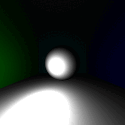

# Raytracing Project 

- MOS 08.5 Informatique graphique

- Enseignant : Nicolas BONNEEL

## Author

Tariq CHELLALI

## Table des Matières

- [Rendu Final](#Rendu-final)
- [Démonstration du Projet](#demo-du-projet)
- [Liste des Fichiers](#liste-des-fichiers)
- [Utilisation](#utilisation)
- [Licence](#licence)
- [Crédit/Citation](#créditcitation)
- [Feedback sur MOS 08.5](#feedback-sur-mos-085)


## Rendu finale

Voici le rendu finale de ce projet. Vous trouverez plus de détails dans le rapport du projet `Rapport_Tariq_CHELLALI.pdf`.

<p align="center">
  
  
  
</p>


## Demo du projet

<p align="center">
  
</p>


## Liste des fichiers

* Dossier `results`:
    - Dossier `gif`: contient le GIF de la démo du projet (voir ci-dessus)
    - Dossier `images_rendering`: contient les images de rendus en format png. 

*  Dossier `Models`: contient les fichiers  obj pour les modèles à utiliser dans  le projet.

* Fichier `raytracer.h`: contient le code source principal du raytracer.

* Fichier `main.cpp`: contient la fonction main du raytracer, qui appelle les fonctions nécessaires pour initialiser  et lancer le rendu.

* Fichier `stb_image_write.h`:  librairie externe nécessaire pour l'écriture d'image.

* Fichier `stb_image.h`:  librairie externe nécessaire pour la lecture et écriture d'image.

* Fichier `Vector.h`:  contient la définition de la classe Vector, et les fonctions auxiaires nécessaires pour l'exécution du fichier raytracer.h et main.cpp

* Fichier  `Montecarlo.py` : programme python qui permet de résoudre l'intégrale du cos*3 en 3D à l'aide de la méthode de MonteCarlo.

* Fichier  `Note_de_cours.md` : ce document contient mes notes de cours

* Fichier `Rapport_Tariq_CHELLALI.pdf`:  rapport final du projet.


## Utilisation

Pour compiler et exécuter le programme, vous aurez besoin d'un  compilateur C++ récent (par exemple g++, MinGW ou Visual Studio). 

Il faut exécuter la commande suivante pour lancer l'application:

```sh
g++ main.cpp -o main.exe -O3 -fopenmp
```
Aprés, il faut exécuter le fichier `main.exe` qui apparaitera dans le dossier du projet.


## License

MIT

## Credit/Citation

Ce travail s'appuie sur quelques ressources qui méritent d'être reconnues :

- Le polycopie du cours de monsieur Nicolas Bonneel  disponible sur ce lien [https://perso.liris.cnrs.fr/nicolas.bonneel/poly_centrale.pdf] 
- Les videos du cours qui ont eté utilisées comme support pour la compréhension des concepts approfondie comme l'éclairage directe et indirecte. Ces vidéos sont disponibles sur ce lien [https://perso.liris.cnrs.fr/nicolas.bonneel/teaching.html] 
- Une ressources externe que j'ai trouvé sur internet pour comprendre plus facilement la théorie du raytracing disponible sur ce lien [https://raytracing.github.io/books/RayTracingInOneWeekend.html]
- Une ressource externe qui m'a aidé à comprendre le mappage des shpères disponible sur ce lien [http://raytracerchallenge.com/bonus/texture-mapping.html]


## Feedback sur MOS 08.5

Le cours a été enrichissant dans le sens théorique parce qu'il discutait des concepts liés à la théorie de la lumière. Également, ce cours a été utile pour pratiquer la programmation en C++ et pour apprendre et appliquer la théorie du cours en parallèle. Par contre, il faut dire que le cours n'est pas facile et nécessite beaucoup de temps pour comprendre les concepts (comme les ombres douces et l'éclairage indirect) et une base solide en programmation en C++ pour déboguer son code 
(Je reconnais que si on ne maîtrise pas bien le C++, cela peut devenir très compliqué et chronographe !)