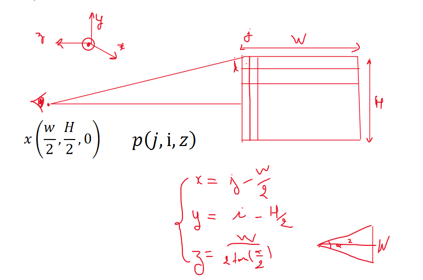
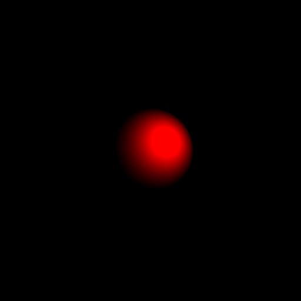

# Ray-tracing-with-C++

## Notre première sphere

- Une source de lumière blanche est représentée par une source omnidirectionnelle positionnée en un point L.
- Une caméra est placée en un point C, composée d'une grille de pixels positionnée à une distance Z de C et de taille (W, H), soit un total de W*H pixels.

Dans un premier temps, une sphère est positionnée devant la caméra, avec son centre à O et un rayon de R.

L'approche est la suivante : des demi-droites sont tracées à partir du centre de la caméra C et dirigées par un vecteur u. Chaque demi-droite traverse la grille en un pixel, résultant ainsi en W*H demi-droites passant par C et dirigées par le vecteur unitaire :

u = ( j-W/2, i-H/2, -W/(2.tan(α/2)))

où (i, j) sont les coordonnées du pixel sur l'écran de la caméra.

Pour chaque demi-droite, l'intersection avec la sphère est calculée. On résout l'équation suivante :

t2 + 2.t.<u,CO> + ||CO||2 - R2 = 0

Si l'intersection existe (au moins une solution t positive), le pixel correspondant est représenté en blanc ; sinon, il reste noir.

### Classes Implémentées :

Les classes mises en œuvre sont les suivantes :

1. Une classe Vector : elle contient les coordonnées du vecteur et diverses méthodes pour surcharger les opérations d'addition, soustraction, produit scalaire, produit par une constante, ainsi que le calcul de la norme.

2. Une classe Sphere : elle contient le centre et le rayon de la sphère.

3. Une classe Ray : elle contient un point du rayon et son vecteur directeur.

## Notre première sphére éclairée

Dans cette version, la couleur attribuée à un pixel de la caméra est modifiée pour obtenir du contraste et discerner les volumes des objets.

Plutôt que d'attribuer une couleur blanche à un pixel où un rayon aurait collisionné avec un objet, on attribue une couleur dont l'intensité est variable.

L'intensité lumineuse en un point P d'un objet est calculée selon la formule :

$\[ I_p = \frac{I}{4\pi\|\text{LP}\|^2} \cdot \langle\mathbf{N},\frac{\mathbf{PL}}{\|\mathbf{PL}\|}\rangle \cdot \frac{\rho}{\pi} \]$

où :

- $\(I\)$ est l'intensité de la source lumineuse au point L.
- $\(\mathbf{N}\)$ est la normale à l'objet (la sphère) au point P (vecteur unitaire).
- $\(\rho\)$ est l'albédo de la sphère, c'est-à-dire la fraction de la lumière que la sphère réfléchit.

Ainsi, la Figure représentée ci-dessous est obtenue. La sphère, représentée avec un albedo rouge, est bien rendue en rouge, et le reste demeure en noir. Cette fois-ci, le volume de la sphère est mieux apprécié, et la localisation de la source de lumière est clairement identifiable grâce aux variations d'intensité lumineuse (les ombres sont mieux représentées). Ce raytracer est plus performant que celui de la version précédente.

