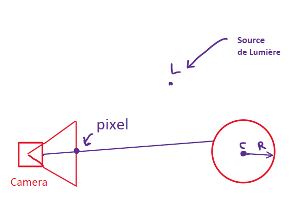
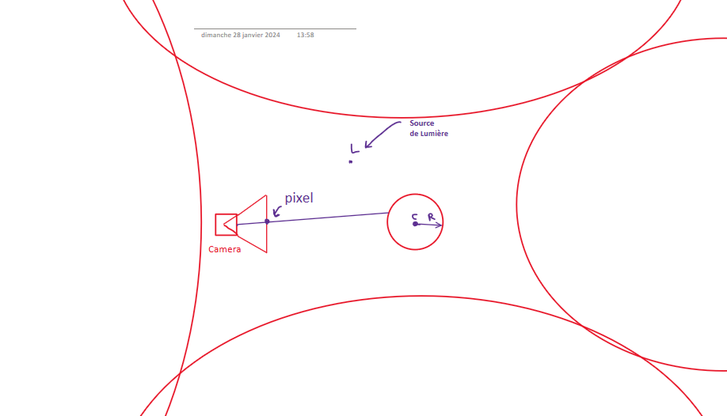
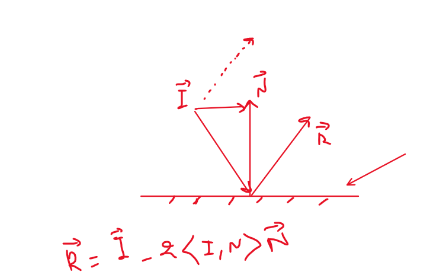

# Ray-tracing-with-C++

## Notre première sphere

- Une source de lumière blanche est représentée par une source omnidirectionnelle positionnée en un point L.
- Une caméra est placée en un point C, composée d'une grille de pixels positionnée à une distance Z de C et de taille (W, H), soit un total de W*H pixels.

Dans un premier temps, une sphère est positionnée devant la caméra, avec son centre à O et un rayon de R.

L'approche est la suivante : des demi-droites sont tracées à partir du centre de la caméra C et dirigées par un vecteur u. Chaque demi-droite traverse la grille en un pixel, résultant ainsi en W*H demi-droites passant par C et dirigées par le vecteur unitaire :

u = ( j-W/2, i-H/2, -W/(2.tan(α/2)))

où (i, j) sont les coordonnées du pixel sur l'écran de la caméra.

Pour chaque demi-droite, l'intersection avec la sphère est calculée. On résout l'équation suivante :

t<sup>2</sup> + 2.t.<u,CO> + ||CO||<sup>2</sup> - R<sup>2</sup> = 0

Si l'intersection existe (au moins une solution t positive), le pixel correspondant est représenté en blanc ; sinon, il reste noir.






### Classes Implémentées :

Les classes mises en œuvre sont les suivantes :

1. Une classe Vector : elle contient les coordonnées du vecteur et diverses méthodes pour surcharger les opérations d'addition, soustraction, produit scalaire, produit par une constante, ainsi que le calcul de la norme.

2. Une classe Sphere : elle contient le centre et le rayon de la sphère.

3. Une classe Ray : elle contient un point du rayon et son vecteur directeur.


### Notre première sphére éclairée

Dans cette version, la couleur attribuée à un pixel de la caméra est modifiée pour obtenir du contraste et discerner les volumes des objets.

Plutôt que d'attribuer une couleur blanche à un pixel où un rayon aurait collisionné avec un objet, on attribue une couleur dont l'intensité est variable.

L'intensité lumineuse en un point P d'un objet est calculée selon la formule :

$\[ I_p = \frac{I}{4\pi\|\text{LP}\|^2} \cdot \langle\mathbf{N},\frac{\mathbf{PL}}{\|\mathbf{PL}\|}\rangle \cdot \frac{\rho}{\pi} \]$

où :

- $\(I\)$ est l'intensité de la source lumineuse au point L.
- $\(\mathbf{N}\)$ est la normale à l'objet (la sphère) au point P (vecteur unitaire).
- $\(\rho\)$ est l'albédo de la sphère, c'est-à-dire la fraction de la lumière que la sphère réfléchit.

Ainsi, la Figure représentée ci-dessous est obtenue. La sphère, représentée avec un albedo rouge, est bien rendue en rouge, et le reste demeure en noir.


L'implémentation de cette partie est donnée dans le fichier `sphere_eclaire.cpp`, pour l'exécuter il suffit d'exécuter cette commande dans un terminale: 

```
g++ -o main sphere_eclaire.cpp
```

## Notre première scene

Nous souhaitons désormais rendre la scène observée plus complexe. Jusqu'à présent, seule une sphère était positionnée devant la caméra.

Nous introduisons une classe "Scene" qui contient un vecteur d'objets. Ce vecteur contiendra les objets (par exemple, des sphères) disposés devant la caméra.

Afin de représenter correctement les objets les uns par rapport aux autres, il est nécessaire de pouvoir déterminer leur profondeur dans l'espace. Pour ce faire, une méthode est mise en œuvre pour vérifier, pour un rayon donné, les objets de la scène qui interceptent ce rayon, et ne conserver que l'objet le plus proche de la caméra (c'est-à-dire l'objet qui va masquer les objets situés derrière lui).

Nous effectuons un essai en créant une scène composée de :

Trois sphères de couleurs bleue, blanche et rouge (de gauche à droite).
Deux murs, respectivement de couleur bleue et rouge, situés à gauche et à droite.
Deux murs en face de la caméra et derrière la caméra (invisible donc), respectivement de couleur verte et magenta.
Un mur au sol de couleur blanche.


L'implémentation de cette partie est donnée dans le fichier `sphere_scenes.cpp`, pour l'exécuter il suffit d'exécuter cette commande dans un terminale: 

```
g++ -o main sphere_scenes.cpp
```

Le bruit provient des incertitudes de calcul dues à la précision numérique de la machine. Ainsi, le point d'intersection peut se retrouver à l'intérieur de la surface au lieu d'être sur la surface. Pour remédier à cela, on déplace le point d'intersection d'une petite quantité $\(\epsilon\)$ vers l'extérieur de l'objet.

``` C++
Ray rayon_sec(P + 0.001*N, (position_lumiere-P).getNormalized());
```

### Amélioration du Contraste des Objets :

Nous cherchons ici à améliorer le contraste des objets. En effet, dans la dernière scène obtenue, nous avons remarqué la faible luminosité des murs en arrière-plan.

La **correction Gamma** est utilisée pour améliorer le contraste en effectuant une opération simple sur l'intensité lumineuse calculée pour chaque pixel :

\[ I = I_{\text{calculée}}^{1/\gamma} \]

avec \(\gamma = 2,2\) et \(1/\gamma = 0,45\).

Cette opération permet de ajuster l'intensité lumineuse, améliorant ainsi le contraste des objets dans la scène. Le paramètre \(\gamma\) joue un rôle crucial dans cette correction, et les valeurs spécifiées (2,2 et 0,45) sont couramment utilisées pour obtenir des résultats visuellement satisfaisants.

### Amélioration avec les Ombres Portées :

Nous cherchons à améliorer davantage le rendu en ajoutant les **ombres portées**, c'est-à-dire les ombres des objets projetées sur les surfaces.

La stratégie adoptée est la suivante : des rayons sont émis dans toutes les directions (vers chaque pixel de l'écran). Pour chaque rayon, on détermine son intersection avec un objet de la scène, puis on vérifie si le rayon entre cette intersection et la source de lumière coupe un autre objet. Si tel est le cas, le pixel d'intersection est rendu plus sombre.

L'implémentation de cette partie est donnée dans le fichier `sphere_scenes_shadow.cpp`, pour l'exécuter il suffit d'exécuter cette commande dans un terminale: 

```
g++ -o main sphere_scenes_shadow.cpp
```


## Surfaces Miroir :

Jusqu'à présent, les surfaces représentées étaient des surfaces opaques avec un albédo. Nous proposons maintenant de représenter un autre type de surface : les surfaces miroir.

Sur une telle surface, un rayon lumineux se reflète avec un angle de réflexion par rapport à la normale de la surface égal à l'angle d'incidence. Les réflexions peuvent être multiples dans le cas de plusieurs surfaces miroir.

Pour mettre en œuvre ces types de surfaces, on crée une fonction récursive appelée "getColor", qui permet de déterminer la couleur à l'intersection d'un rayon avec une surface opaque, ou le cas échéant, entre le rayon réfléchi et une surface miroir.

Avec cette propriété, notre raytracer évolue pour devenir un pathtracer.

Le rayon incident \(i\) est réfléchi par la surface miroir en un rayon $\(r\)$ tel que :

$\[ r = i - 2\langle i, \mathbf{N} \rangle \mathbf{N} \]$



Cette formulation reflète le rayon par rapport à la normale de la surface. Cette fonction de réflexion permet de simuler le comportement des surfaces miroir dans la scène, ajoutant ainsi des éléments de réalisme et de complexité visuelle au rendu final du raytracer.


